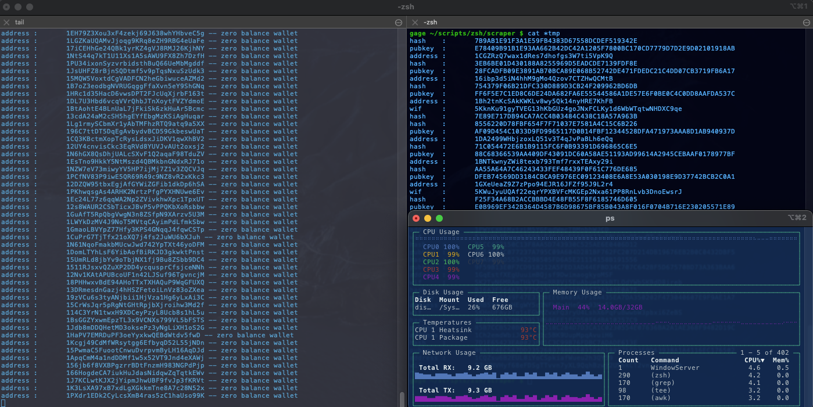

# btc wallet scraper 
simple, robust random bitcoin wallet generator and balance checker: 
 + run btc algorithm to generate keys, wif, address 
 + check balance of address on blockchain.info 
 + store address and wif of non-zero balance wallets



features: 
+ parallelize processes for increased computes
run 100 processes:
```bash
$ ./run.zsh 100 
```

+ logging:
```bash 
$ tail nohup.out
address	:	16MaVnvAMtAbxsCUSRUByWzDtvt7PfRUq5 -- zero balance wallet
address	:	1Cn1nZpcHmkyJTakhXkt1gvA68G8rc2ZJY -- zero balance wallet
address	:	14ECNDbV76Q2LgGeRgwqg7fcNqcnfVxQkn -- zero balance wallet
address	:	19pLb5smbaREYPa6w8zAQwZsHGKsRzrbbV -- zero balance wallet
address	:	167DT7WcJXCqS4NmfGFv4jHTyfGg7JvH7b -- zero balance wallet
address	:	19Ek2J8FkMKLiB52SpPF8zPq2hZF4rnZAP -- zero balance wallet
address	:	1DF9HaDJroYStrmgAHZdMCjgRxtNyyxgCM -- zero balance wallet
address	:	1ED3t116VkzrBPA1YaAnW997urFVXNfiPj -- zero balance wallet
address	:	127BSdebfp5Fu7T9W7Nm5xRg9XCv5zUSB9 -- zero balance wallet
address	:	1MX7C5Wys6DcLjN6xN4kvnkTgSGroPZkru -- zero balance wallet
```

+ stop all proceses: 
```bash 
$ ./kill-scrape.sh
killing scrape processes...
kill: 65279: No such process
kill: 65299: No such process
zsh: killed     ./kill-scrape.sh
``` 
